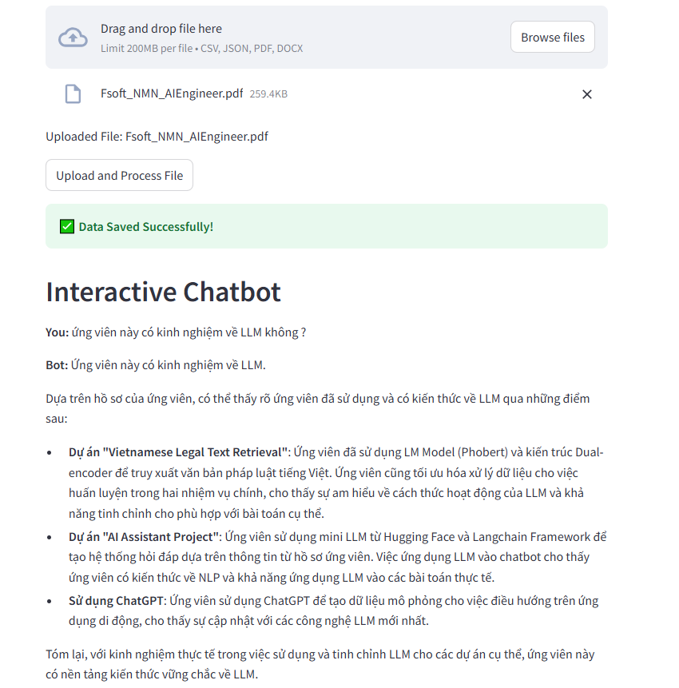
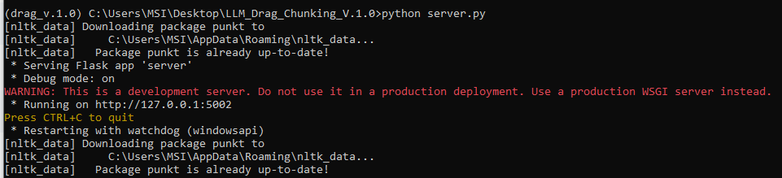
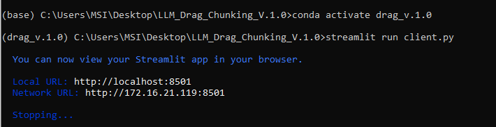

# Drag and Drop RAG

## Overview
<p align="center"> 
    </p>

This project is a **Retrieval-Augmented Generation (RAG)** pipeline that enables users to upload data (CSV, JSON, PDF, or DOCX files), store it in a **Chroma vector store**, and interact with it through a chatbot powered by **Gemini** (version `gemini-1.5-pro`). The chatbot retrieves relevant data from the uploaded files, enhances user queries, and returns responses using **LLMs**.

## Features
1. **Upload CSV, JSON, PDF, or DOCX files** – Supports multiple file types and allows users to select columns for vector search.
2. **Store and retrieve vector embeddings** using **Chroma**.
3. **Interactive chatbot** using the **Gemini API** to generate responses based on user queries and stored data.
4. **Customizable LLMs** – Select columns from which the LLM should answer queries.

## Running the Application
1. Clone the repository to your local machine:
   ```bash
   git clone https://github.com/NickyMinhNhat/LLM_Drag_Chunking_V.1.0.git
   cd LLM_Drag_Chunking_V.1.0
   ```

2. Install the required Python packages:
   ```bash
   pip install -r requirements.txt
   ```

3. a. Server: Run server using Flask:
   ```bash
   python server.py
   ```
<p align="center">  </p>

3. b. Client: Run the Streamlit app:
   ```bash
   streamlit run client.py
   ```
<p align="center">  </p>

4. Access the application on `http://localhost:8501` in your browser.

## Steps to Use:
1. **Upload Data**: Upload a CSV, JSON, PDF, or DOCX file. Select the column to be indexed for vector search.
2. **Save Data**: The file is saved in the Chroma vector store with vector embeddings generated by the `all-MiniLM-L6-v2` or `keepitreal/vietnamese-sbert` model.
3. **Setup LLMs**: Enter your **Gemini API key** to configure the chatbot for generating responses. Get the key [here](https://aistudio.google.com/app/apikey).
4. **Chat**: Start interacting with the chatbot, which retrieves and augments responses using the data from the uploaded file.

## Notes:
- A **Gemini API key** is required to set up the chatbot.
- Ensure that data is saved to the **Chroma vector store** before interacting with the chatbot.

## Troubleshooting:
- If no data is retrieved during a query, ensure that the correct columns are selected for answering queries.
- Make sure the API key is valid and the collection has been initialized before interacting with the chatbot.

---

This reflects the latest update, including the correct repository link.
